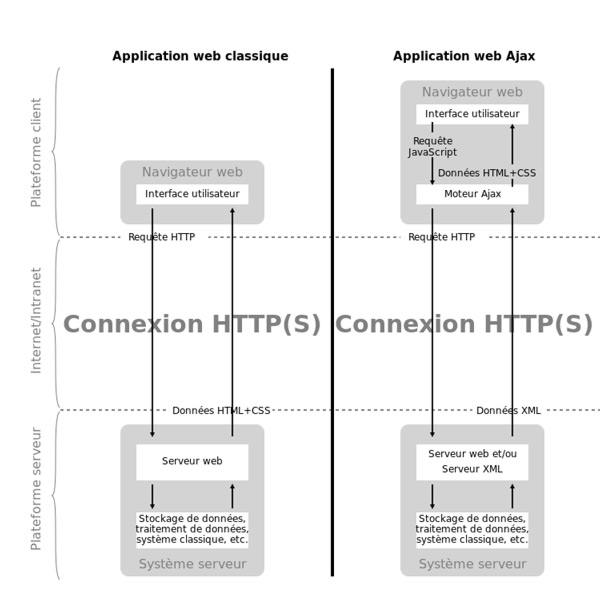

# Ajax

[Ajax](http://fr.wikipedia.org/wiki/Ajax_(informatique) ou **Asynchronous JavaScript and XML** est une technologie se basant sur l'objet [XMLHttpRequest](http://fr.wikipedia.org/wiki/XMLHttpRequest).

**XMLHttpRequest** est un objet ActiveX ou JavaScript qui permet d'obtenir des données au format XML, JSON, mais aussi HTML, ou encore texte simple à l'aide de requêtes HTTP.

Ajax va pouvoir récupérer ou transmettre sur un serveur des données sans rafraichir notre navigateur.

** Exemples d'applications utilisant AJAX :**
Gmail, Google Maps, Youtube et les onglets Facebook.

## Le principe

*Source : [Wikipédia](http://fr.wikipedia.org/wiki/Ajax_(informatique)*

Dans une application Web, la méthode classique de dialogue entre un navigateur et un serveur est la suivante : lors de chaque manipulation faite par l'utilisateur, le navigateur envoie une requête contenant une référence à une page Web, puis le serveur Web effectue des calculs, et envoie le résultat sous forme d'une page Web à destination du navigateur. Celui-ci affichera alors la page qu'il vient de recevoir. Chaque manipulation entraîne la transmission et l'affichage d'une nouvelle page. L'utilisateur doit attendre l'arrivée de la réponse pour effectuer d'autres manipulations.

En utilisant Ajax, le dialogue entre le navigateur et le serveur se déroule la plupart du temps de la manière suivante : un programme écrit en langage de programmation JavaScript, incorporé dans une page web, est exécuté par le navigateur. Celui-ci envoie en arrière-plan des demandes au serveur Web, puis modifie le contenu de la page actuellement affichée par le navigateur Web en fonction du résultat reçu du serveur, évitant ainsi la transmission et l'affichage d'une nouvelle page complète.

La méthode classique de dialogue utilise des mécanismes propres au World Wide Web, qui sont incorporés dans tous les navigateurs ainsi que les robots d'indexation, et ne nécessite pas de programmation. Au contraire, le fonctionnement d'Ajax nécessite de programmer en JavaScript les échanges entre le navigateur et le serveur Web. Il nécessite également de programmer les modifications à effectuer dans la page Web à la réception des réponses, sans quoi les dialogues se font à l'insu de l'utilisateur.

En Ajax, comme le nom l'indique, les demandes sont effectuées de manière asynchrone : le navigateur Web continue d'exécuter le programme JavaScript alors que la demande est partie, il n'attend pas la réponse envoyée par le serveur Web et l'utilisateur peut continuer à effectuer des manipulations pendant ce temps.

## Prérequis

**Avant de vous lancer dans l'aventure AJAX**

Vous devez travailler sur un serveur pour que vos échanges Ajax fonctionnent. Vous pouvez travailler en local et instaler un logiciel du type [WAMP](http://www.wampserver.com/), [MAMP](http://www.mamp.info/en/), [XAMPP](https://www.apachefriends.org/fr/index.html) …
