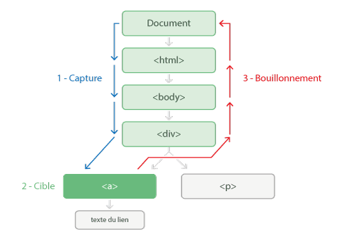

# Gestionnaire d'attachement d'événement

Dans la précédente partie, nous avons vu comment effectuer des tâches lors d'un événement sur le navigateur.

Dans cette partie, nous verrons comment attacher un événement comme le clic d'une souris, la modification d'un champ de formulaire, une touche clavier pressée …

## Anatomie d'un événement

L’exécution d’un événement se fait en trois phases :

1. la capture
2. l’atteinte de la cible
3. le bouillonnement.



## Méthode .on()

**API :** http://api.jquery.com/on/

La méthode `.on()` attache un ou plusieurs gestionnaires d'événements sur les éléments sélectionnés et les éléments enfants.
Elle permet d'écouter les éléments créés dynamiquement.

Vous pouvez retrouver la liste des événements à cette adresse : http://api.jquery.com/category/events/

La méthode `.on()` prend comme événement : <br/>
*blur, focus, focusin, focusout, load, resize, scroll, unload, click, dblclick, mousedown, mouseup, mousemove, mouseover, mouseout, mouseenter, mouseleave, change, select, submit, keydown, keypress, keyup, error*

### Exemples

Dans l'exemple ci-dessous, nous écoutons l'événement au clic sur l'élément **.btn**, puis nous retournons la chaine de caractères dans une fenêtre d'alerte.

```js
$('.btn').on('click', function() {
    alert( $(this).text() );
});
```

<p data-height="90" data-theme-id="7816" data-slug-hash="nsftm" data-default-tab="result" class='codepen'>See the Pen <a href='http://codepen.io/sutterlity/pen/nsftm/'>.on()</a> by Sutterlity (<a href='http://codepen.io/sutterlity'>@sutterlity</a>) on <a href='http://codepen.io'>CodePen</a>.</p>

---

Faisons de même, mais en sélectionnant le parent au départ.

```js
$('.box').on('click', '.btn', function() {
    alert( $(this).text() );
});
```

<p data-height="90" data-theme-id="7816" data-slug-hash="mnBlt" data-default-tab="result" class='codepen'>See the Pen <a href='http://codepen.io/sutterlity/pen/mnBlt/'>.on() -2 </a> by Sutterlity (<a href='http://codepen.io/sutterlity'>@sutterlity</a>) on <a href='http://codepen.io'>CodePen</a>.</p>

---

Prenons un autre exemple (plutôt tordu) : au clic ajoutons / supprimons-lui la classe **.border** , au survol de **.pod** ajoutons la classe **.hover** et pour finir, en sortant retirons la classe **.hover**.


```js
$('.pod').on({
  click: function() {
    $(this).toggleClass('have-border');
  }, mouseenter: function() {
    $('body').css('background', '#212121')
  }, mouseleave: function() {
    $('body').css('background', '#fff')
  }
});
```


<p data-height="220" data-theme-id="7816" data-slug-hash="KlFhm" data-default-tab="result" class='codepen'>See the Pen <a href='http://codepen.io/sutterlity/pen/KlFhm/'>.on() - Multiple event</a> by Sutterlity (<a href='http://codepen.io/sutterlity'>@sutterlity</a>) on <a href='http://codepen.io'>CodePen</a>.</p>

<script async src="//codepen.io/assets/embed/ei.js"></script>
