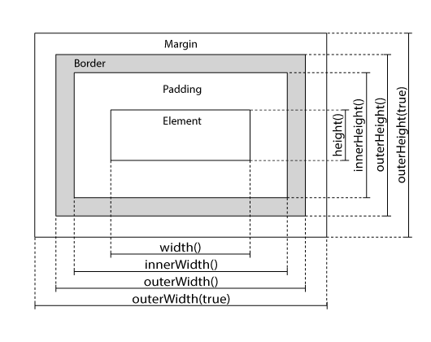

# Les dimensions

Dans cette partie, nous verrons les méthodes de calcul de dimensions `.width()`, `.innerWidth()`, `.outerWidth()`, `.height()`, `.innerHeight()`, `.outerHeight()`.

Voici le modèle de boite suivant lequel se base les méthodes.



| Méthode | Description |
| -- | -- |
| `.width()` | Définit ou retourne la largeur d'un élément.<br/> Les padding, border et les marges ne sont pas compris dans le calcul. |
| `.innerWidth()` | Définit ou retourne la largeur d'un élément.<br/> Les padding sont compris dans le calcul, mais pas les border et les marges. |
| `.outerdWidth()` | Définit ou retourne la largeur d'un élément.<br/> Les padding et les borders sont compris dans le calcul, mais pas les marges. |
| `.outerdWidth(true)` | Définit ou retourne la largeur d'un élément.<br/> Les padding, border et les marges sont compris dans le calcul. |
| `.height()` | Définit ou retourne la hauteur d'un élément.<br/> Les padding, border et les marges ne sont pas compris dans le calcul. |
| `.innerHeight()` | Définit ou retourne la hauteur d'un élément.<br/> Les padding sont compris dans le calcul, mais pas les border et les marges. |
| `.outerdHeight()` | Définit ou retourne la hauteur d'un élément.<br/> Les padding et les borders sont compris dans le calcul, mais pas les marges. |
| `.outerdHeight(true)` | Définit ou retourne la hauteur d'un élément.<br/> Les padding, border et les marges sont compris dans le calcul. |

Voyons maintenant à quoi peuvent maintenant nous servir ces méthodes.

## Exemple 1

Nous pouvons donner la hauteur de la fenêtre aux éléments `<section>`, redimensionnable au resize du navigateur (astuce pour le responsive).

```js
// Création de la fonction
function fullHeight() {
    // Attribuons à 'hWindow' la hauteur du navigateur
    var hWindow = $(window).height();
    // Ajoutons la hauteur de 'hWindow' aux éléments section
    $('section').css('height', hWindow);
}

$(function() {
    // Lancer la fonction quand le DOM est ready
    fullHeight();
});

$(window).resize(function() {
    // Lancer la fonction au redimensionnement de la fenêtre
    fullHeight();
});
```

<p data-height="300" data-theme-id="7816" data-slug-hash="bgops" data-default-tab="result" class='codepen'>See the Pen <a href='http://codepen.io/sutterlity/pen/bgops/'>.height()</a> by Sutterlity (<a href='http://codepen.io/sutterlity'>@sutterlity</a>) on <a href='http://codepen.io'>CodePen</a>.</p>

## Exemple 2

Nous pouvons aussi calculer la hauteur d'un élément pour l'assigner à un autre.

```js
// Création de la fonction
function sameHeight(elem) {
    // initialisation de la hauteur de base à 0
    var tallest = 0;
    // Parcours de tous les éléments
    elem.each(function() {
        // Mise en variable de la hauteur de l'élément
        var thisHeight = $(this).height();
        // Condition pour savoir si la hauteur de l'élément est plus grande que 'tallest'
        if(thisHeight > tallest) {
            // Si l'élément est plus grand, nous assignons la nouvelle valeur à 'tallest'
            tallest = thisHeight;
        }
    });
    // Nous appliquons le style CSS sur l'élément
    elem.height(tallest);
}

$(function(){
    // Lancer la fonction quand le DOM est ready
    sameHeight( $('.box-list-item') );
});
```

<p data-height="256" data-theme-id="7816" data-slug-hash="otBkx" data-default-tab="result" class='codepen'>See the Pen <a href='http://codepen.io/sutterlity/pen/otBkx/'>.height()-2</a> by Sutterlity (<a href='http://codepen.io/sutterlity'>@sutterlity</a>) on <a href='http://codepen.io'>CodePen</a>.</p>
<script async src="//codepen.io/assets/embed/ei.js"></script>


